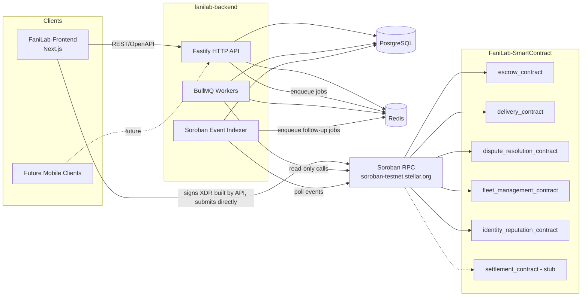
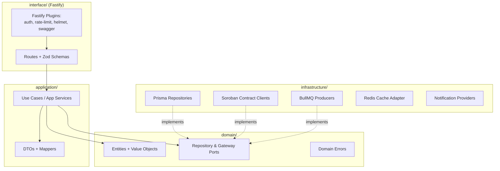
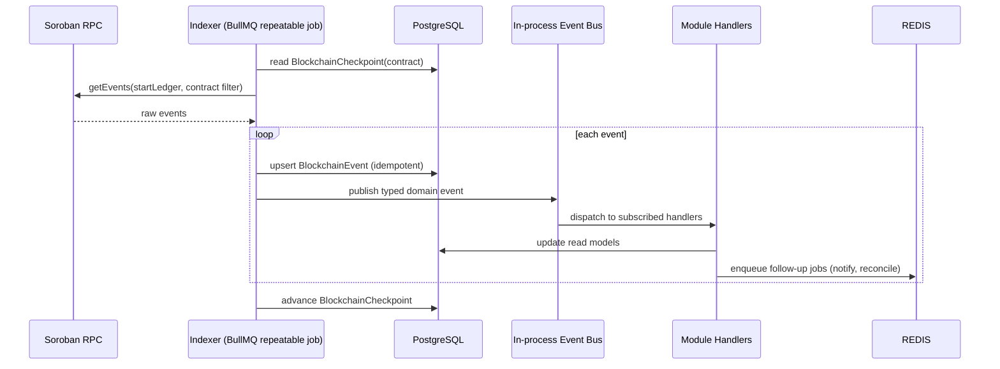
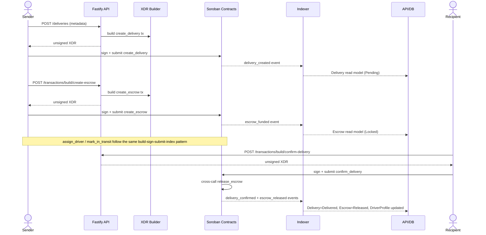
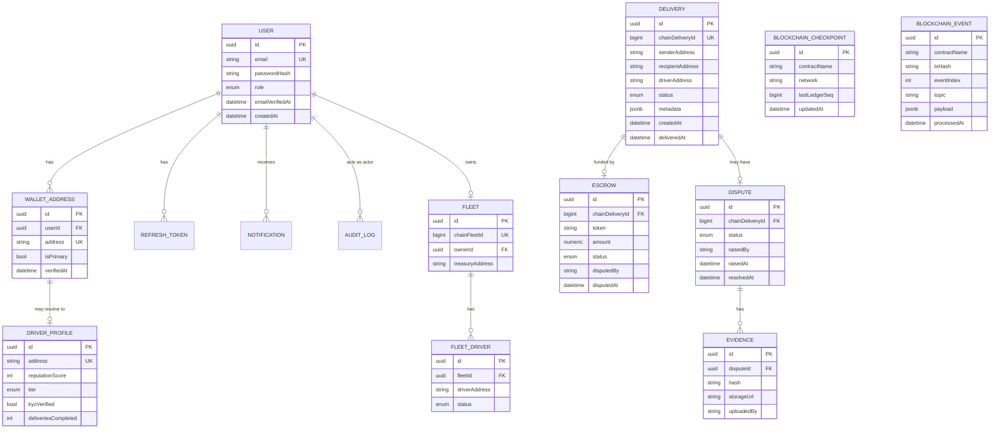
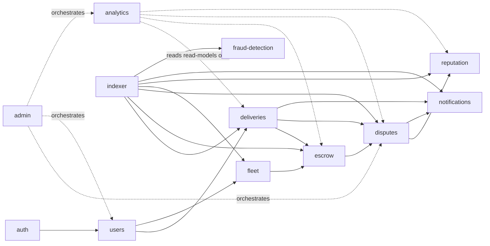

# FaniLab Backend — Architecture

**Status:** Phase 3 design output. No business logic is implemented yet — this document is the blueprint Phase 4 (scaffold) and Phase 5 (implementation) build against.

This document assumes familiarity with [`PHASE_1_DOMAIN_ANALYSIS.md`](./PHASE_1_DOMAIN_ANALYSIS.md) (smart contract source of truth) and [`PHASE_2_REFERENCE_ANALYSIS.md`](./PHASE_2_REFERENCE_ANALYSIS.md) (reference-implementation lessons).

---

## 1. Architectural Style

**Modular hybrid of Clean Architecture and Domain-Driven Design**, organized by *bounded context module* rather than by technical layer at the top level. Each module is internally layered:

```
domain/          → entities, value objects, domain errors, repository & port interfaces (no framework/DB/HTTP imports)
application/      → use-cases (application services), orchestration, DTOs, mapping
infrastructure/   → Prisma repository implementations, Soroban clients, external providers
interface/        → Fastify routes, request/response schemas (Zod), controllers (thin)
```

Dependency rule: `interface` → `application` → `domain` ← `infrastructure`. `domain` has zero outward dependencies. `infrastructure` implements `domain` port interfaces (repository pattern) — it depends inward, never the reverse. This is enforced by lint boundary rules (Phase 4) and matches the explicit brief requirement ("clean architecture ... avoid controller-heavy architecture").

Rationale for *module-first* over *layer-first* top-level folders (the opposite of the SwiftChain reference, which mixed everything under one flat `controllers/services/models`): it keeps each bounded context's full vertical slice — and its tests — together, directly preventing the duplicate/parallel-implementation drift observed in Phase 2 (§4).

---

## 2. System Context



Key decision, informed by Phase 2 §5.7: **the backend never holds sender/recipient/driver/fleet-owner private keys.** Every contract call that requires that party's `require_auth()` (which, per Phase 1, is nearly all of them) is exposed as a `POST /transactions/build/...` endpoint that returns an unsigned XDR envelope; the client signs with their own wallet and either submits directly to RPC or posts the signed envelope back to `POST /transactions/submit` for the backend to relay and track. The backend only ever signs transactions for operations that are legitimately backend-owned (e.g., none identified yet at admin level — admin actions in the contracts also require the admin's own signature; if a future backend-managed admin hot-wallet is introduced, that is a distinct, explicitly-scoped security decision documented in `SECURITY.md`, not assumed here).

---

## 3. Layered View



---

## 4. Modules (Bounded Contexts)

| Module | Owns | Backed by contract(s) | Notes |
|---|---|---|---|
| `auth` | Local accounts, JWT/refresh, email verification, password reset, RBAC | — (off-chain only, Phase 1 §1) | Roles: `CUSTOMER`, `COURIER`, `FLEET_MANAGER`, `ADMIN` |
| `users` | Profile data, wallet-address linking (challenge/signature verification), KYC intake workflow | `identity_reputation_contract` (final KYC boolean only) | KYC documents stored off-chain; only the verified flag is pushed on-chain |
| `deliveries` | Delivery read model, lifecycle orchestration, unsigned-XDR builders for create/assign/transit/confirm/cancel/dispute | `delivery_contract` | State machine mirrored 1:1 from Phase 1 §4; backend never mutates status directly — it reflects indexed events, and only *builds* transactions for the client to sign |
| `escrow` | Escrow read model, XDR builders for create/release/refund, reconciliation worker | `escrow_contract` | Must not assume settlement/currency-swap works (Phase 1 §8) |
| `fleet` | Fleet read model, invite/accept/remove orchestration, **payout-address pre-resolution helper** | `fleet_management_contract` | Resolves `get_payout_address` client-side-callable before `create_escrow` is built, since chain doesn't enforce this automatically (Phase 1 §6) |
| `disputes` | Dispute case read model reconciling both on-chain dispute layers (Phase 1 §5), evidence upload + hash verification | `dispute_resolution_contract`, `escrow_contract` (dispute fields) | Evidence files stored in object storage, content hash must match the 32-byte hash recorded on-chain |
| `reputation` | Canonical driver reputation/tier read model | `identity_reputation_contract` (canonical, per Phase 1 §12 decision), `delivery_contract` (secondary/informational counters, clearly labeled non-authoritative) | |
| `indexer` | Soroban RPC polling, checkpointing, idempotent event ingestion, internal event dispatch | all six contracts | See §6 |
| `notifications` | Multi-channel delivery (email now; SMS/push documented as future work) driven by indexed domain events | — | BullMQ-backed |
| `analytics` | Aggregate reporting (GMV, completion rate, dispute rate, driver tiers distribution) computed from read models | — | Read-only, no writes |
| `fraud-detection` | Heuristic anomaly scoring (v1: rule-based on delivery/escrow/dispute velocity per actor); ML-based scoring explicitly out of scope for v1 and documented as future work | — | Consumes indexed events |
| `admin` | Cross-module admin operations (dispute review UI backend, user management, audit log viewer) | — | RBAC-gated, thin orchestration over other modules |

Cross-cutting **shared kernel** (`src/shared/`): config loading + Zod-validated env schema, logger (Pino), centralized error types + Fastify error handler, audit-logging decorator, Redis client, Prisma client singleton, pagination/response envelope helpers.

---

## 5. Folder Structure

```
fanilab-backend/
├── src/
│   ├── modules/
│   │   ├── auth/
│   │   │   ├── domain/
│   │   │   ├── application/
│   │   │   ├── infrastructure/
│   │   │   └── interface/
│   │   ├── users/            (same internal layout)
│   │   ├── deliveries/
│   │   ├── escrow/
│   │   ├── fleet/
│   │   ├── disputes/
│   │   ├── reputation/
│   │   ├── indexer/
│   │   ├── notifications/
│   │   ├── analytics/
│   │   ├── fraud-detection/
│   │   └── admin/
│   ├── blockchain/
│   │   ├── soroban-client.ts        (resilient RPC wrapper: retry/backoff/circuit-breaker)
│   │   ├── contracts/               (typed client per contract: escrow, delivery, dispute, fleet, identity, settlement)
│   │   └── xdr/                     (sc-val.ts: generic ScVal↔native encode/decode; build-invoke-transaction.ts + simulate-read-call.ts: generic write/read contract-call helpers every module's own contract client builds on)
│   ├── shared/
│   │   ├── config/                  (Zod env schema + typed config)
│   │   ├── errors/                  (single error hierarchy + Fastify error handler)
│   │   ├── logger/
│   │   ├── database/                (Prisma client singleton)
│   │   ├── queue/                   (BullMQ connection + queue registry)
│   │   ├── cache/                   (Redis adapter)
│   │   ├── events/                  (in-process pub/sub — indexer publishes, future modules subscribe)
│   │   ├── http/                    (Fastify plugins: helmet, cors, rate-limit, swagger, auth guard)
│   │   ├── jwt/                     (shared access/refresh token sign+verify)
│   │   └── testing/                 (shared test fixtures/factories + DB/RPC reachability gates)
│   ├── workers/
│   │   └── index.ts                 (BullMQ worker process entrypoint — separate from API process)
│   ├── app.ts                        (Fastify instance composition — no side effects, testable)
│   └── server.ts                     (process bootstrap: app.listen, graceful shutdown)
├── prisma/
│   ├── schema.prisma
│   ├── migrations/
│   └── seed.ts
├── docs/
│   ├── ARCHITECTURE.md
│   ├── ROADMAP.md
│   ├── API_REFERENCE.md
│   ├── DATABASE.md
│   ├── AUTHENTICATION.md
│   ├── EVENT_INDEXER.md
│   ├── SECURITY.md
│   ├── DEPLOYMENT.md
│   ├── OBSERVABILITY.md
│   └── adr/                          (Architecture Decision Records, mirroring the smart-contract repo's own ADR practice)
├── tests/
│   └── e2e/                          (cross-module flows; module-local unit/integration tests live inside each module)
├── .github/
│   ├── workflows/                    (ci.yml, release.yml, dependabot config target)
│   ├── ISSUE_TEMPLATE/
│   └── PULL_REQUEST_TEMPLATE.md
├── docker/
├── docker-compose.yml
├── Dockerfile
├── Makefile
├── .env.example
├── CONTRIBUTING.md
├── CODE_OF_CONDUCT.md
├── CODEOWNERS
└── README.md
```

Module-local tests live next to source (`*.spec.ts` colocated, per Phase 2 §5.6's explicit corrective to SwiftChain's flat `tests/` directory) so coverage gaps are visually obvious in each module.

---

## 6. Blockchain Event Indexer — Design Summary

(Full detail deferred to `docs/EVENT_INDEXER.md` in Phase 4/5; this is the Phase 3 design contract.)

- **Checkpointing**: one `BlockchainCheckpoint` row per contract per network (`contractName`, `network`, `lastLedgerSeq`, `updatedAt`). Polling resumes from the persisted checkpoint, never from "now," so no gap is possible across restarts.
- **Idempotent ingestion**: every raw event is first persisted to `BlockchainEvent` keyed by a unique `(contractName, network, rpcEventId)` constraint (the RPC's own globally-unique event id) *before* domain handlers run, so re-polling an overlapping ledger range is a safe no-op (directly adopting the Phase 2 §3 idempotency lesson).
- **Dual dispute/reputation reconciliation**: handlers for `dispute_resolution_contract`'s five dispute events and `escrow_contract`'s dispute-adjacent events (`delivery_disputed`, `dispute_resolved`) both write into one `Dispute` timeline per `deliveryId`, per the Phase 1 §5 finding that neither contract alone tells the full story.
- **Event-shape adapter boundary**: the raw Soroban RPC → typed-event mapping is isolated behind one adapter interface per contract so a future SDK/event-API migration (Phase 1 §9 — SDK 27 deprecation warning already present in the contracts) only touches `blockchain/contracts/*`, not module domain logic.
- **Dispatch**: after durable ingestion, the indexer publishes an internal domain event (in-process event emitter, not yet a distributed bus — documented as a v2 candidate if the system needs multi-instance indexer scaling) that module-local handlers (deliveries, escrow, disputes, reputation, fleet, notifications, fraud-detection) subscribe to.
- **Lag monitoring**: `now_ledger - lastLedgerSeq` exposed on `/health/indexer` and to the metrics/observability layer, adopting the Phase 2 §3 "indexer lag as first-class health signal" lesson.



---

## 7. Delivery + Escrow Happy-Path Sequence (backend's role)



---

## 8. Database Schema (Prisma, entity-level — full field list in `docs/DATABASE.md`, Phase 4)



`BLOCKCHAIN_EVENT` carries a unique constraint on `(contractName, network, rpcEventId)` — the idempotency key from §6.

---

## 9. API Design Principles

- REST, versioned under `/api/v1`, documented live via `@fastify/swagger` + `@fastify/swagger-ui` (OpenAPI 3.1), Zod schemas as the single source of truth for both validation and generated docs (`fastify-type-provider-zod`).
- Resource-oriented per module (`/deliveries`, `/escrow`, `/disputes`, `/fleets`, `/drivers/:address/reputation`, `/users`, `/auth`), plus a dedicated `/transactions/build/*` family for unsigned-XDR construction and `/transactions/submit` for relaying signed envelopes with status tracking.
- All mutating endpoints that ultimately reflect on-chain state return the **pending, backend-tracked transaction record**, not a synchronously-updated resource — the resource itself only reaches its new state once the indexer confirms the corresponding event, avoiding a false impression of instant consistency the chain doesn't provide.
- Consistent envelope: `{ data, meta }` for success, `{ error: { code, message, details } }` for failures, mapped 1:1 from the single domain error hierarchy (§4/shared kernel).
- Idempotency-Key header support on all `/transactions/build/*` and `/transactions/submit` endpoints, given retries are expected around blockchain submission.

Full endpoint-by-endpoint reference is a Phase 4/5 deliverable (`docs/API_REFERENCE.md`), generated and hand-maintained alongside implementation, not fabricated ahead of the code that defines it.

---

## 10. Module Dependency Graph



No module reaches into another module's `infrastructure/` or `domain/` internals directly — cross-module reads go through the other module's public `application/` use-case interface, keeping the boundary enforceable by lint rule in Phase 4.

---

## 11. Deferred/Open Design Questions (carried from Phase 1 §12, not resolved here)

- Whether reputation reconciliation should attempt to *also* surface `delivery_contract`'s redundant counters (informational-only field) or omit them entirely from the API — leaning toward surfacing as a clearly-labeled secondary field for transparency/debugging, final call in Phase 5 when the `reputation` module is implemented.
- Whether an internal event bus is sufficient long-term or whether a distributed bus (e.g. Redis Streams) is needed once the indexer needs to run as more than one instance — out of scope for v1, documented in `ROADMAP.md` future enhancements.
- Multi-network/multi-deployment contract-registry support — v1 assumes a single active network/contract-ID set from config; a `ContractRegistry` table is a documented future enhancement if multi-region deployment becomes a requirement.
